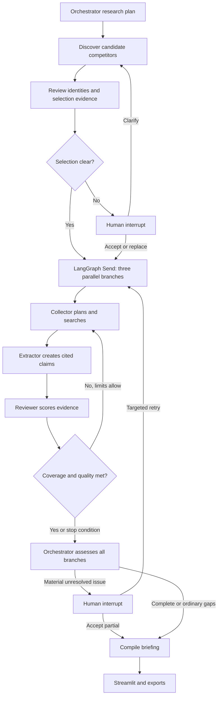

# Market Lens — Multi-agent Competitor Intelligence

A SaaS-focused competitive intelligence application built with **LangGraph** and
**Streamlit**, with **You.com as the primary web/news search provider**. Research
produces three cited competitor profiles, a comparison matrix, recent news, and a
structured briefing. Industry profiles separate SaaS research rules from the
reusable orchestration engine.

The offline demo runs the same graph using explicitly fictional fixtures. Its
companies, pricing, features and news are not real market findings.

## Run the interface

Use Python 3.11 or newer. From this project directory:

```bash
python3 -m venv .venv
source .venv/bin/activate
python -m pip install -r requirements-dev.txt
streamlit run app.py
```

Open http://localhost:8501 and click **Start research** with **Offline demo** on.
The normal scenario completes automatically. The conflict scenario presents a
human review request; accepting partial results preserves the disagreement and
omits disputed prices from verified comparisons. The ambiguous scenario pauses
competitor selection until you clarify, replace competitors, or accept caveats.

For live research:

```bash
cp .env.example .env
```

Set `YOU_API_KEY` and `OPENAI_API_KEY`, then restart Streamlit and switch off the
demo toggle. `OPENAI_MODEL` defaults to `gpt-4.1-mini`; choose a model your account
can access that supports Responses API structured outputs. No model or search
credentials are needed for the demo, and missing live credentials are detected
before creating a research run. Keys are read from the environment or `.env`,
never stored in research records or rendered in traces.

The You.com adapter uses `POST https://ydc-index.io/v1/search`, requests live
Markdown page extraction, restricts initial pricing/features/positioning searches
to official domains, and applies an explicit date range to news. Extraction may
incur additional provider charges. If extraction is unavailable, the source is
labeled as a snippet and cannot independently satisfy the claim confidence gate.
There is no automatic alternate search provider.

## Agents and delegation

| Agent | Work |
| --- | --- |
| Orchestrator | Creates a structured research strategy, delegates competitor branches, enforces routing, compiles supported findings |
| Competitor Discovery | Identifies the target product, proposes up to six candidates, scores competitive overlap, selects three |
| Research Collector | Plans focused queries and gathers official web evidence and independent news using You.com |
| Analysis Extractor | Extracts structured pricing, features, positioning and news claims with evidence IDs |
| Evidence Reviewer | Independently checks discovery identities and selection support, then verifies extracted claims and requests follow-up research |



Each competitor branch is an explicit LangGraph subgraph. `Send` executes up to
three competitor branches concurrently. A dictionary reducer merges profiles by
domain, so parallel writes cannot overwrite another competitor's findings. Human
review happens in the parent graph after branch results are available.

The orchestrator and collector use bounded model-generated plans. Graph rules
enforce required research categories, concurrency, retry limits, coverage checks,
and termination regardless of what a model proposes.

## Research scope and evidence

Inputs include target company/domain, product or use case, customer segment,
geography, news window, and call/time limits. A company domain is required to
reduce identity ambiguity. Geography informs queries and competitive overlap;
it is not an assurance that every returned source is local to that market.

Competitor overlap is scored with product **50%**, customer **35%**, and geography
**15%**. The ranking is relative to the research scope, not market share. Discovery
distinguishes direct competitors from adjacent alternatives, excludes duplicate
domains and the target domain, rejects unsupported selection citations, and
escalates weak evidence, fewer than three usable candidates, or a close third/
fourth ranking. Human replacements are explicitly labeled as human selections.

Each evidence record retains a URL, publisher, text excerpt, source type,
publication date when known, original retrieval time, category, and official-domain
flag. Source IDs include both URL and content: two conflicting snapshots of a
page can be retained. Exact duplicate URLs/text and exact syndicated content are
deduplicated. Near-duplicate articles can still remain and need reviewer judgment.

Pricing retains the plan, amount, currency, unit, billing cadence, annual commitment,
region and other conditions when the source states them. The comparison displays
the billing basis rather than implying all amounts are comparable. “Contact sales”
is a valid finding. Feature labels use the configured industry taxonomy. Positioning
distinguishes company statements from interpretation. News retains event and
publication dates separately; undated or out-of-window evidence cannot establish
a verified recent-news finding. Missing data is reported as a research gap.

## Observation and feedback loop

**Confidence and completeness are separate.** Completeness measures how many of
the four required categories have an accepted claim. It does not imply exhaustive
coverage of every plan or feature. Profile confidence averages the supported
claims' evidence scores; gaps remain visible independently.

Claim confidence combines source authority **25%**, reviewer-assessed directness
**35%**, extraction depth **15%**, corroboration **10%**, and freshness **15%**.
Non-news freshness reflects the current retrieval snapshot; news requires dated
evidence in the requested window. An official source gets higher authority, but
does not establish independent validation of a vendor's marketing promises.
Corroboration requires distinct publishers and different source text. This is a
quality heuristic, not a calibrated probability of correctness.

- **Accept:** supported claim, valid citations, confidence ≥ 0.80, no conflict.
- **Follow up:** required categories missing or evidence below the acceptance gate.
- **Escalate:** unresolved material conflicts or supported profile claims averaging
  below 0.60 after bounded follow-up. Identity/selection ambiguity also escalates.
- **Finish partial:** ordinary unavailable information, exhausted budgets, or no
  improvement without a material issue requiring a human decision.

Invented source IDs, duplicate claim/assessment IDs and missing assessments cannot
pass the acceptance gate. Conflicts cap confidence at 0.55; snippets alone cap it
at 0.69. Synthesis receives accepted claims and a verified target baseline only.
An insight with missing or invented claim references is omitted entirely. Strategic
insights are labeled as interpretations rather than established market facts.

Default limits are **40 search attempts**, **35 analysis attempts**, and a **600
second active execution window**. Every external call attempt, including a retry,
is reserved atomically in SQLite across all concurrent branches. Provider calls
have timeouts. OpenAI calls default to five total attempts per call, configured by
`OPENAI_MAX_ATTEMPTS` (1–10). You.com calls retain three total attempts.
Transient transport errors, rate limits and server failures use exponential
backoff/jitter. `Retry-After` seconds or HTTP dates and OpenAI's `retry-after-ms`
are honored without shortening the server delay. Long waits remain cancellable;
an expired run deadline stops the wait and produces partial findings instead of
retrying early. Authentication, permission, invalid request and quota/billing/
spend-limit failures stop without retries. In-flight network calls may finish after a
cancellation or time limit; subsequent calls are blocked.

`OPENAI_MAX_CONCURRENCY` defaults to **1** (allowed range 1–8). A shared semaphore
limits model calls across competitor branches and runs within this process; web
research remains parallel. The slot is held during retry waits, and a shared
cooldown also prevents a queued model call from bypassing the final failed call's
rate-limit/server delay. Set these options in `.env` and restart Streamlit to apply
them. Increasing per-call attempts does not increase a run's overall call budgets:
each attempted request still counts against **Analysis attempts**.

```dotenv
OPENAI_MAX_ATTEMPTS=5
OPENAI_MAX_CONCURRENCY=1
```

Each competitor gets one initial round and up to two follow-up rounds. Research
also stops if a follow-up adds no new evidence. Human-requested retries grant
another bounded set of rounds using the **remaining call budgets** and a fresh
active time window. They do not silently raise call limits. Start a new run to
research with larger call budgets.

Human review can clarify product scope, replace competitors, accept partial
results, request targeted research, or cancel. Accepting partial results never
turns disputed claims into verified claims. Accepted selection caveats and human
decisions remain in the briefing.

## Persistence and tracing

`artifacts/checkpoints.sqlite` stores LangGraph checkpoints. `artifacts/research.sqlite`
stores run metadata, budgets, query/model caches, results, and timestamped events.
Restart the application, open a saved run, and resume its checkpoint or pending
human review. Run one Streamlit process against a data directory; a second process
should use a different `RESEARCH_DATA_DIR` to avoid simultaneously resuming a run.

Successful tool/model results are cached within a run. Replaying a node after an
interrupt or process failure reuses completed calls when their inputs match.
Failed calls are not cached. A crash after a provider responds but before its
result is saved can repeat that request on recovery; exactly-once external billing
cannot be guaranteed.

The UI's **Agent collaboration trace** records delegation, query planning, tool
calls, evidence handoffs, model token usage, confidence changes, retries, node
completion, human escalation/decisions, and stop conditions. Events include
subgraph namespaces to relate branch activity to the parent graph. Download the
trace as JSON. Trace summaries describe observable decisions, not private model
reasoning. Graph nodes also use LangChain's standard tracing infrastructure; local
events are sufficient without an external tracing account.

OpenAI failures record HTTP status, API error code/type, SDK exception type,
request ID when available, retryability, attempt count and retry delay. Provider
error prose, raw response bodies, headers and credentials are not stored. The UI
shows an actionable failure message plus **Failure details**. Quota/billing issues
require checking credits and account/project limits; temporary rate limits need
backoff and potentially smaller requests. Timeouts/connections need connectivity
or request-size investigation; server failures can be resumed later. Historical
events from before this change do not contain the new diagnostics.

This is a local prototype: saved runs are shared within its data directory and
there is no user authentication. Live source excerpts are sent to OpenAI for
analysis. Model-based verification reduces unsupported findings but does not
guarantee truth, completeness, or competitor-selection accuracy.

## CLI and exports

```bash
# Fictional demo, including Markdown/JSON briefing and collaboration trace
python research.py --output artifacts/demo-report

# Human review demo
python research.py --scenario conflict

# Resume using the run ID printed by the previous command
python research.py --resume RUN_ID --decision '{"action":"accept_partial"}'

# Live research after configuring keys
python research.py --live --company "Your company" --domain yourcompany.com \
  --scope "Your product category" --geography US --output artifacts/live-report
```

The Streamlit downloads preserve evidence citations and expose the structured
JSON. Reports are snapshots, not continuously updated monitoring.

## Extend to another industry

Register a new `IndustryProfile` in `market_research/industries.py`. Supply its
description, discovery terms, feature taxonomy and pricing rules. It appears in
the UI automatically. For example, a logistics profile could use delivery coverage,
tracking, warehousing and integrations as feature labels, with per-shipment pricing
rules. The graph, budgets, evidence records, human review and tracing remain shared.

If an industry requires new analysis categories (e.g. manufacturing capacity or
regulatory approvals), extend `Claim.category`, `quality.REQUIRED`, collector query
templates and rendering together. The built-in demo fixtures model SaaS only;
new industries need representative fixtures and evaluation examples.

## Validate

```bash
python -m pytest -q
python -m pip check
ruff check .
ruff format --check .
```

Tests exercise the actual LangGraph pipeline with fictional search/model adapters,
atomic budgets, conflict/identity escalation, targeted loops, citation rejection,
news date validation, cancellation, fresh-instance checkpoint recovery, concurrent
run isolation, the You.com HTTP contract/retries/cache, the real OpenAI SDK's
structured-output parsing/cache/refusal handling with mocked HTTP, and Streamlit normal/review
flows. They make no paid API calls. `requirements-lock.txt` captures the environment
validated on Python 3.13/macOS; use `requirements-dev.txt` for a compatible fresh
installation on another platform.

Live quality evaluation still requires API keys and representative companies.
Review selected competitors, pricing conditions, source relevance, news dates,
unsupported insights, and failure recovery against manually checked sources.

## Project files

- `app.py`: Streamlit inputs, live progress, review controls, findings and trace.
- `research.py`: CLI runs, checkpoint resume and report exports.
- `market_research/graph.py`: parent graph and parallel competitor subgraphs.
- `market_research/models.py`: validated structured outputs and input schemas.
- `market_research/providers.py`: You.com and OpenAI adapters, normalization/retries.
- `market_research/quality.py`: confidence, grounding and completeness gates.
- `market_research/storage.py`: SQLite metadata, atomic budgets, cache and events.
- `market_research/service.py`: background workers and checkpoint lifecycle.
- `market_research/industries.py`: extensible industry research profiles.
- `market_research/demo.py`: explicitly fictional fixtures.
- `market_research/rendering.py`: cited report export and comparison rows.

Implementation references: [You.com Search](https://you.com/docs/api-reference/search/v1-search),
[You.com extraction](https://you.com/docs/guides/search),
[LangGraph Graph API](https://docs.langchain.com/oss/python/langgraph/graph-api),
[LangGraph persistence](https://docs.langchain.com/oss/python/langgraph/persistence),
[LangGraph interrupts](https://docs.langchain.com/oss/python/langgraph/interrupts),
[OpenAI structured outputs](https://developers.openai.com/api/docs/guides/structured-outputs),
[Streamlit fragments](https://docs.streamlit.io/develop/api-reference/execution-flow/st.fragment).
